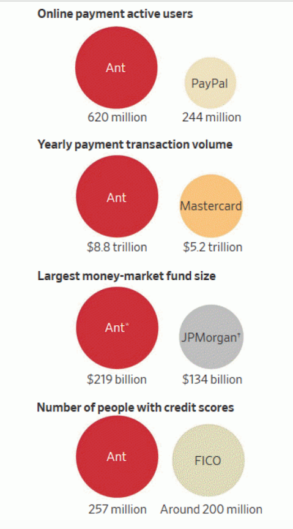

#                                                                 FinTech Case Study: Ant Financial

### Overview and Origin
Founded in October 2014, Ant Financial is the largest FinTech company in the world right now. Formerly known as the Alipay, as they have gathered more consumer data and grew as a company, they started to branch out and offer more financial services- rebranding themselves as the Ant Financial. Alipay was founded by Jack Ma back in 2004 with the help of the Alibaba Group before transforming into Ant Financial in 2014. In 2015, Ant Financial raised [$4.5 billion in a funding round](https://blogs.wsj.com/briefly/2016/04/26/5-things-to-know-about-chinas-ant-financial/) with investors. By the end of that year, the company was valued at about $60 billion. However, this year they are [valued at about $200 billion.](https://www.reuters.com/article/us-ant-financial-valuation-exclusive/exclusive-chinas-ant-aims-for-200-billion-price-tag-in-private-share-sales-sources-idUSKBN1ZG1C6)

### Business Activities
Alipay has made it easy for buyers and sellers to make transactions online with a small fee. Their service is very similar to PayPal except that they do not charge any foreign exchange fee. According to [ChinaSalesCo](https://www.chinasalesco.com/services/exporter-tips/110-how-does-alipay-compare-with-paypal):
>Another key difference is Paypal assists the wire of funds between users'-bank accounts, but Alipay qualifies and then moves funds between buyer-and-merchant-Alipay accounts.

Along with these, as Alipay offers mobile wallet and touch pay, they have eliminated the need for cash for almost all the everyday transactions. In order to build such services and store data, they mainly used [applications](https://stackshare.io/alipay/alipay) such as jQuery, PHP, React, JAVA, nginx, AngularJS, Lodash, Moment.js, Ant Design, Zepto.

As Alipay expanded into Ant Financial, they have been able to offer more services than ever such as insurance, credit, loans, credit scoring, and wealth management. But their biggest financial service beside the Alipay has to be Yue Bao. Yue Bao means “leftover treasure”. This service made investing in a [money market fund](https://qz.com/1791778/ant-financials-yue-bao-is-no-longer-the-worlds-biggest-money-market-fund/) easy for consumers. 
>Yu’e Bao shocked banking executives around the world with its immense growth. It started when the widely used payment service Alipay (operated by Ant Financial, an affiliate of Alibaba at the time) added the money market fund to its app. The fund was designed for spare cash, and Chinese consumers began using it like a checking account. They are able to pay for anything, from haircuts to hot pot dinners, directly out of their high-yielding investment holdings, seamlessly and easily. 

The fact that they acquired so much data over the years, it made it so much easier for them to dominate any financial service as they can very successfully predict consumer’s behavior. The company currently has [over 1.2 billion users around the world](https://www.cnbc.com/2019/11/19/ant-financial-no-ipo-timetable-but-plans-to-acquire-more-users-outside-china.html).The reason for them to be so huge is that they compete in various sectors of financial sectors as mentioned before. Here is a [graph](https://textile-future.com/archives/13257) that shows how dominant they are in different sectors:

Their ecosystem made it easy for their users to access different types of financial needs and just like Apple, once you’re in the ecosystem, you rarely leave because it is so convenient. And recently, they are partnering up with [companies from other countries](https://qz.com/1570052/ant-financials-alipay-is-expanding-rapidly-outside-of-china/) to expand their market as 
>Alipay is available in 54 markets, and is a partner with the likes of India’s Paytm (Ant also has
a stake in the fast growing payment service). Observers have long seen Alipay’s Chinese tourist strategy as a “spearhead” to one day go after non-Chinese customers.

### Landscape
Ant Financial offers so many services, it is impossible to tie them down to just one domain. They started off under the Payment/Billing domain and moved on to Investment management, Insurance, Personal finance, online banking, wealth management, open banking, and Robo-advising. The sheer amount of consumer data and the funding and influence and the Alibaba group have allowed them to be this dominant in the Asian market. But just having the data isn’t enough, their data mining, machine learning, the ecosystem have allowed them to come this far. [For example](https://www.applicoinc.com/blog/ant-financial-services-platform-largest-fintech-in-world/), 
> Yue Bao was able to use Alipay data to identify users who left a positive balance in their Alipay digital wallet. Any users with a balance would be contacted, educated on the benefits on a money market fund, and invited to open an account. They could also, of course, choose to invest in any fund listed on Ant Fortune. In a market starved for consumer financial products, Ant’s investment platforms were an instant hit.

They have been so dominant in China, there is no competition worth mentioning however, as they have been expanding to other parts of Asia, Europe and even trying to come to the American market, they can face serious competition with the likes of PayPal, Visa, Mastercard, JPMorgan, Goldman Sachs etc. 

### Results
Ant Financial has shaken up all the financial services in China. In 2017, they handled more transactions than Mastercard, became the world's largest money market fund, and completed more than $8 billion worth of transactions which is more than double the GDP of Germany. China’s banks complain Ant siphons away their deposits, causing them to pay higher interest rates, and is a factor leading them to close branches and ATMs. One commentator at a state-owned television channel described Ant’s huge money-market fund as [“a vampire sucking blood from banks.”](https://www.wsj.com/articles/jack-mas-giant-financial-startup-is-shaking-the-chinese-banking-system-1532885367) Now, they are aiming to dominate the rest of the world as they are already partnering up with companies from other parts of Asia and Europe and also, eyeing expanding their service to America. And when and if they do expand to America, they would have to face even stronger, larger and stable competitions such as Amazon, PayPal, JPMorgan, Apple, Citibank etc. 

### Recommendation
If I were to advise them, I would suggest they get in the cryptocurrency field. I would advise to build something that can compete with Coinbase. Coinbase is one of the top FinTech companies in America that allows customers to buy, sell, use and trade cryptocurrency at a stable price as well as it allows businesses to accept cryptocurrencies as a form of payment. To be able to build such a service, they would probably need to use applications such as nginx, Ruby, Rails, D3.js, IronMQ.

Many would say that cryptocurrencies are the future but Alipay does not accept cryptocurrency as a form of payment. To get ahead and compete with other companies I think Ant financial needs to bring what they do best- their ecosystem and build on it, add more services and to incorporate cryptocurrency would help them grow furthermore. 

